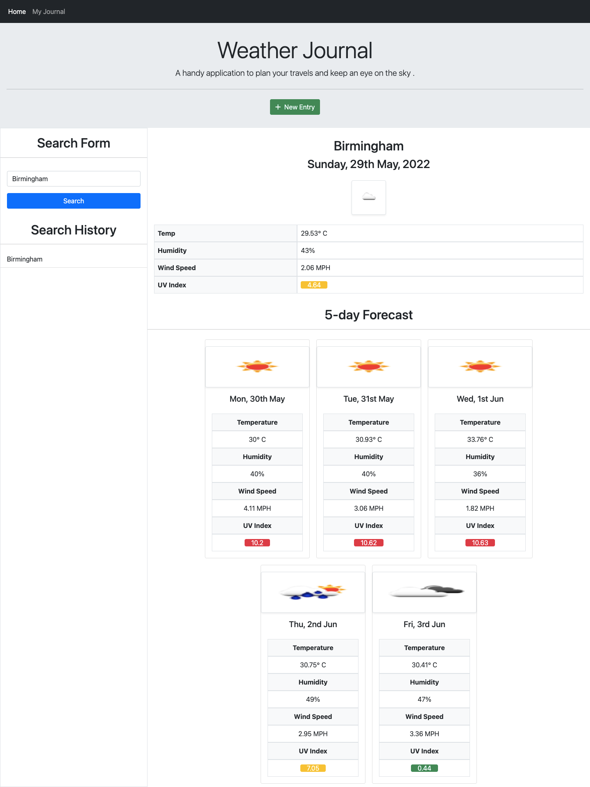

# Weather Dashboard

### A handy application to search weather conditions worldwide.

# How It Works

Given a weather dashboard with form inputs,
when I search for a city
then I am presented with current and future conditions for that city and that city is added to the search history.

When I view current weather conditions for that city
then I am presented with the city name, the date, an icon representation of weather conditions, the temperature, the humidity, the wind speed, and the UV index.

When I view the UV index
then I am presented with a color that indicates whether the conditions are favorable, moderate, or severe.

When I view future weather conditions for that city
then I am presented with a 5-day forecast that displays the date, an icon representation of weather conditions, the temperature, the wind speed, and the humidity.

When I click on a city in the search history
then I am again presented with current and future conditions for that city.

# Languages/ Libraries & Frameworks Used

I have used HTML, CSS, JavaScript , Moment JS, JQuery, and Bootstrap.

# API

Open weather api to retrieve the weather information.

# Screenshots

